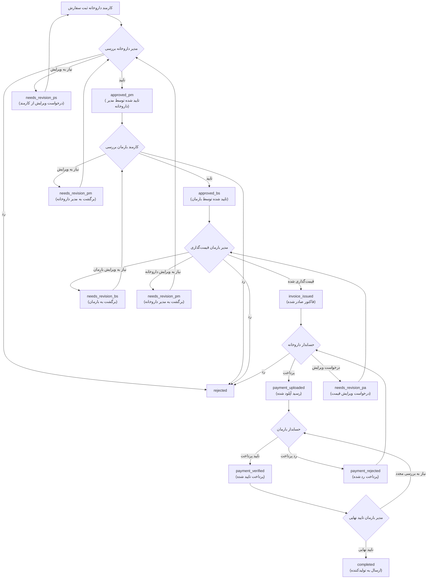

# فرایند مدیریت سفارشات دارویی

## نمای کلی فرایند

## مراحل دقیق

### 1. ثبت سفارش (کارمند داروخانه)
- **Status**: `pending`
- **عملیات**: انتخاب داروها، تعیین تعداد، ثبت سفارش
- **مرحله بعد**: بررسی مدیر داروخانه

### 2. بررسی مدیر داروخانه
- **Status های ورودی**: `pending`, `needs_revision_pm`
- **گزینه‌های عمل**:
  - **تایید** → `approved_pm`
  - **رد** → `rejected`
  - **درخواست ویرایش** → `needs_revision_ps`

### 3. بررسی کارمند بارمان
- **Status های ورودی**: `approved_pm`, `needs_revision_bs`
- **گزینه‌های عمل**:
  - **تایید** → `approved_bs`
  - **رد** → `rejected`
  - **درخواست ویرایش** → `needs_revision_pm`

### 4. قیمت‌گذاری مدیر بارمان
- **Status های ورودی**: `approved_bs`, `needs_revision_pa`
- **گزینه‌های عمل**:
  - **صدور فاکتور** → `invoice_issued`
  - **درخواست ویرایش از بارمان** → `needs_revision_bs`
  - **درخواست ویرایش از داروخانه** → `needs_revision_pm`
  - **رد** → `rejected`

### 5. پرداخت حسابدار داروخانه
- **Status ورودی**: `invoice_issued`
- **گزینه‌های عمل**:
  - **آپلود رسید** → `payment_uploaded`
  - **درخواست ویرایش** → `needs_revision_pa`
  - **رد** → `rejected`

### 6. تایید پرداخت حسابدار بارمان
- **Status ورودی**: `payment_uploaded`
- **گزینه‌های عمل**:
  - **تایید پرداخت** → `payment_verified`
  - **رد پرداخت** → `payment_rejected`

### 7. تایید نهایی مدیر بارمان
- **Status ورودی**: `payment_verified`
- **گزینه‌های عمل**:
  - **تایید نهایی** → `completed`
  - **بررسی مجدد** → برگشت به حسابدار بارمان

## Status های فعلی سیستم

### Status های اصلی
- `pending` - در انتظار بررسی مدیر داروخانه
- `approved_pm` - تایید شده توسط مدیر داروخانه
- `approved_bs` - تایید شده توسط بارمان
- `invoice_issued` - فاکتور صادر شده
- `payment_uploaded` - رسید آپلود شده
- `payment_verified` - پرداخت تایید شده
- `completed` - تکمیل شده و ارسال به تولیدکننده
- `rejected` - رد شده

### Status های ویرایش
- `needs_revision_ps` - نیاز به ویرایش کارمند داروخانه
- `needs_revision_pm` - نیاز به ویرایش مدیر داروخانه
- `needs_revision_bs` - نیاز به ویرایش بارمان
- `needs_revision_pa` - نیاز به ویرایش قیمت‌گذاری
- `payment_rejected` - پرداخت رد شده

## نقش‌های سیستم

### داروخانه
- **کارمند** (`pharmacy_staff`): ثبت سفارش، ویرایش سفارش
- **حسابدار** (`pharmacy_accountant`): پرداخت فاکتور، آپلود رسید
- **مدیر** (`pharmacy_manager`): بررسی و تایید سفارش، تایید قیمت‌گذاری

### بارمان
- **کارمند** (`barman_staff`): بررسی سفارش تایید شده
- **حسابدار** (`barman_accountant`): تایید پرداخت
- **مدیر** (`barman_manager`): قیمت‌گذاری، صدور فاکتور، تایید نهایی

### ادمین
- **ادمین** (`admin`): مدیریت کلی سیستم، گزارش‌گیری

## فایل‌های کلیدی سیستم

- `PharmacyStaffDashboard.tsx` - ثبت سفارش
- `PharmacyManagerDashboard.tsx` - بررسی و تایید سفارش، تایید قیمت‌گذاری
- `PharmacyAccountantDashboard.tsx` - پرداخت فاکتور
- `BarmanStaffDashboard.tsx` - بررسی سفارش
- `BarmanManagerDashboard.tsx` - قیمت‌گذاری و تایید نهایی
- `BarmanAccountantDashboard.tsx` - تایید پرداخت

## جداول Database

- `orders` - سفارشات اصلی
- `order_items` - اقلام سفارش
- `order_approvals` - تاریخچه تاییدها
- `order_item_pricing` - قیمت‌گذاری اقلام
- `user_roles` - نقش‌های کاربران
- `pharmacies` - داروخانه‌ها

تاریخ آخرین به‌روزرسانی: دی ۱۴۰۳